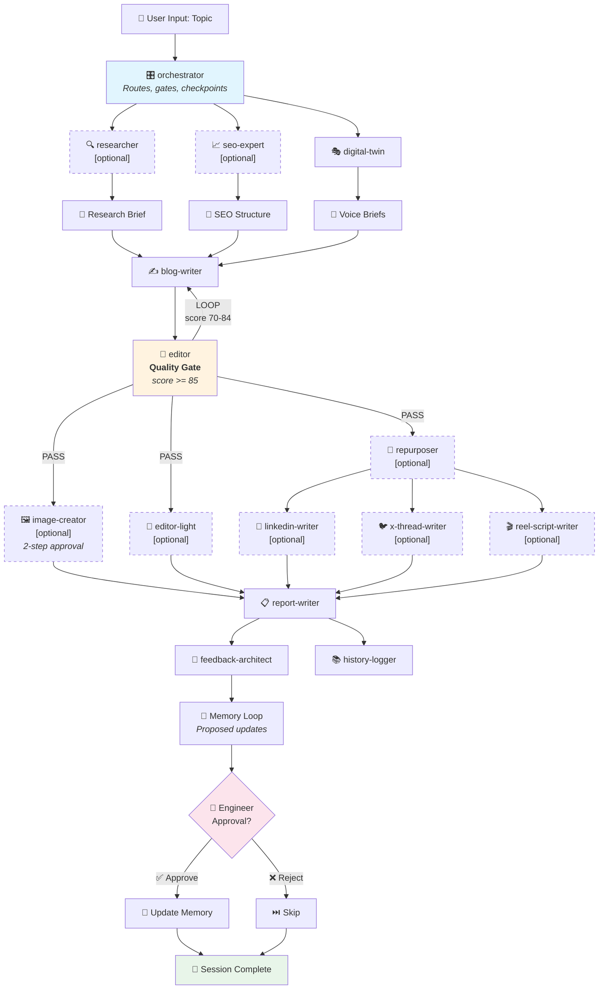

# hello-writer

> A dry, reusable, multi-agent content engine for blogs, social posts, and video scripts.

**hello-writer** is an AI-powered content pipeline that turns a single topic into polished, multi-platform content. Think of it as "CI/CD for content" — research, SEO, voice adaptation, writing, editing, image generation, and repurposing, all orchestrated automatically through [OpenCode](https://opencode.ai).


---

## Table of Contents

- [Quick Start](#quick-start)
- [What It Does](#what-it-does)
- [Architecture](#architecture)
- [Installation](#installation)
- [Usage](#usage)
- [Platform Support](#platform-support)
- [How It Works](#how-it-works)
- [Configuration](#configuration)
- [Digital Twin (Voice Profile)](#digital-twin-voice-profile)
- [Memory Loop](#memory-loop)
- [Adding Custom Agents](#adding-custom-agents)
- [Troubleshooting](#troubleshooting)
- [Contributing](#contributing)

---

## Quick Start

### Option A: Fast Setup (Terminal)

```bash
# 1. Get the project
git clone <repo-url> hello-writer
cd hello-writer

# 2. Run the terminal wizard
./setup.sh

# 3. Start creating content
opencode run workflows/content-engine.md
```

### Option B: AI-Guided Setup (Conversational)

```bash
# 1. Get the project
git clone <repo-url> hello-writer
cd hello-writer

# 2. Run the AI-guided setup workflow
opencode run workflows/setup-workflow.md

# 3. Start creating content
opencode run workflows/content-engine.md
```

---

## What It Does

Give **hello-writer** a topic like *"Introduction to Rust for Web Developers"* and it will:

1. **Research** the topic (facts, stats, trends, gaps)
2. **Plan SEO** (keywords, structure, meta descriptions)
3. **Adapt to your voice** (via Digital Twin persona)
4. **Write a blog post** (800-2,500 words, Markdown)
5. **Edit and score** the content (quality gate, 0-100 score)
6. **Generate images** (3 AI concepts, engineer-approved)
7. **Repurpose** into social content (LinkedIn, X/Twitter, Reels)
8. **Learn from the session** (proposes memory updates for next time)

All with **confidence gates**, **checkpoints**, and **engineer approval** at key decision points.

---

## Architecture



### Phase Flow

| Phase | Agent | Purpose | Skippable? |
|-------|-------|---------|------------|
| 1 | orchestrator | Routes and checkpoints | Never |
| 2 | researcher | Web research, fact-checking | Yes |
| 3 | seo-expert | Keywords, structure, meta | Yes |
| 4 | digital-twin | Voice brief generation | Rarely |
| 5 | blog-writer | Long-form blog post | No |
| 6 | editor | Quality gate (score 0-100) | No |
| 7 | image-creator | AI image concepts + generation | Yes |
| 8 | repurposer | Distill blog into briefs | Yes |
| 9 | linkedin-writer | LinkedIn post | Yes |
| 10 | x-thread-writer | X/Twitter thread | Yes |
| 11 | reel-script-writer | Video script | Yes |
| 12 | editor-light | Short-form quality check | Yes |
| 13 | report-writer | Session report | No |
| 14 | feedback-architect | Learning + memory proposals | No |
| 15 | history-logger | Audit trail | No |

### Confidence Gates

Every session is gated by **confidence scores**:

| Gate | Threshold | Action if Failed |
|------|-----------|------------------|
| Research | `high` required, `medium` checkpoints | `low` = BLOCK |
| SEO Opportunity | `high`/`medium`/`low` tracked | `low` = checkpoint |
| Content Quality | `>= 85` PASS, `70-84` LOOP, `< 70` BLOCK | LOOP up to 2x |
| Session | `high`/`medium`/`low` retrospective | `low` = major review |

---

## Installation

### Prerequisites

- [OpenCode CLI](https://opencode.ai/docs/installation) installed
- At least one AI provider configured (`opencode providers login`)

### Setup

hello-writer offers **two setup paths**:

#### Path 1: Fast Terminal Setup (`./setup.sh`)

Best for: users who want speed, know what they want, and are comfortable in the terminal.

```bash
# Clone the repository
git clone <repo-url> hello-writer
cd hello-writer

# Run the interactive setup wizard
./setup.sh
```

The wizard will:
1. Check your OpenCode installation
2. Discover available AI models
3. Let you assign models (smart defaults or custom)
4. Choose platforms (Blog, LinkedIn, X, Reels)
5. Build your Digital Twin voice profile (15 questions)
6. Select a styleguide (Google Dev, custom, or none)
7. Generate all agent definitions

**Re-run anytime:**
```bash
./setup.sh  # Detects existing config, offers update/overwrite
```

#### Path 2: AI-Guided Setup (`workflows/setup-workflow.md`)

Best for: users who want a conversational experience, follow-up questions, and automatic writing sample analysis.

```bash
# Clone the repository
git clone <repo-url> hello-writer
cd hello-writer

# Run the AI-guided setup
opencode run workflows/setup-workflow.md
```

The AI setup agent will:
1. Check your environment and discover models
2. **Conversationally** assign models with explanations
3. Ask follow-up questions to deepen understanding
4. **Analyze your writing samples** and extract voice patterns automatically
5. Build a richer Digital Twin profile from the analysis
6. Select a styleguide
7. Generate and validate everything

**Key differences from `./setup.sh`:**

| Feature | `./setup.sh` | AI-Guided |
|---------|-------------|-----------|
| **Interaction** | Linear Q&A | Conversational chat |
| **Follow-ups** | None | 1-2 per question |
| **Sample analysis** | Stores raw text | Extracts patterns automatically |
| **Speed** | ~2 minutes | ~5-10 minutes |
| **Best for** | Power users | First-time users, rich profiles |

---

## Usage

### Running the Workflow

```bash
# Run via OpenCode
opencode run workflows/content-engine.md

# Or start OpenCode and select the workflow
opencode
```

### During a Session

The orchestrator will guide you through:
- **Phase 0**: Confirm topic, platforms, and image preference
- **Phase 1+**: Agents run automatically with checkpoints at gates
- **End**: Review proposed memory updates and approve/reject

### Output Structure

```
output/
└── 2026-05-08_my-topic/
    ├── _meta.md              # Session report
    ├── final/
    │   ├── blog.md           # Blog post
    │   ├── linkedin.md       # LinkedIn post (if enabled)
    │   ├── x_thread.md       # X thread (if enabled)
    │   └── reel_script.md    # Reel script (if enabled)
    ├── artifacts/
    │   ├── research-brief.md
    │   ├── seo-analysis.md
    │   ├── voice-brief-*.md
    │   └── editor-output.md
    └── images/
        ├── my-topic-photo-1.png
        ├── my-topic-photo-2.png
        └── my-topic-photo-3.png
```

---

## Platform Support

| Platform | Output | Conditional |
|----------|--------|-------------|
| **Blog** | Markdown, 800-2,500 words | Always enabled |
| **LinkedIn** | Native post format | Optional |
| **X / Twitter** | Numbered thread, <=280 chars/tweet | Optional |
| **Reels** | 30-90s script with visual cues | Optional |

Enable/disable platforms during setup or by editing `config/content-engine.yml`.

---

## How It Works

### Template System

Agent definitions live in `templates/agents/*.md.template` with `{{VAR}}` placeholders. During setup, these are rendered into `agents/*.md` with your chosen models.

```yaml
# templates/agents/blog-writer.md.template
---
name: blog-writer
model: {{BLOG_WRITER_MODEL}}
---
```

After setup:
```yaml
# agents/blog-writer.md
---
name: blog-writer
model: opencode-go/deepseek-v4-pro
---
```

### Single Source of Truth

All configuration lives in `config/content-engine.yml`:

```yaml
models:
  orchestrator: "opencode-go/kimi-k2.6"
  blog_writer: "opencode-go/deepseek-v4-pro"
  # ... etc

platforms:
  blog: true
  linkedin: true
  x: false
  reel: false

features:
  digital_twin: true
  images: true
  styleguide: "google-dev-light"
```

---

## Configuration

### Changing Models

Edit `config/content-engine.yml` and re-run:
```bash
./setup.sh  # Select "Update" to keep other settings
```

Or edit directly and re-render agents:
```bash
# Edit config/content-engine.yml, then:
./setup.sh --render-only  # (not yet implemented, edit and re-run setup)
```

### Disabling Agents

In `config/content-engine.yml`:

```yaml
platforms:
  blog: true
  linkedin: false   # Skip LinkedIn writer
  x: false          # Skip X thread writer
  reel: false       # Skip reel script writer
```

### Adding a Custom Agent

1. Create `templates/agents/my-agent.md.template`
2. Add model placeholder: `model: {{MY_AGENT_MODEL}}`
3. Add to `setup.sh` model assignment section
4. Add to `workflows/content-engine.md` phase list
5. Re-run `./setup.sh`

---

## Digital Twin (Voice Profile)

Your **Digital Twin** is a persona profile that ensures all content sounds like *you*, not generic AI output.

### What's in a Voice Profile?

```markdown
# Digital Twin Profile

## Identity
- Name: Alex Rivera
- Background: Full-stack developer
- Core belief: "Code is communication first"

## Voice Core
- Personality: Clear, practical, self-deprecating
- Metaphors: Cooking, gardening, Legos
- Forbidden: "simply", "just", "obviously"

## Voice by Platform
### Blog
- Tone: Educational, friendly
- Structure: Story hook -> H2s -> soft CTA
```

### Creating Your Profile

During setup, answer 15 questions about:
- Your identity and background
- Your personality and values
- Platform-specific tones
- Forbidden words and phrases
- Writing samples (optional)

Or start with the **demo persona** (Alex Rivera) and customize.

### Evolution

The Digital Twin **learns over time**. After each session, the feedback-architect proposes updates (new forbidden words, adjusted tones, etc.). You approve each change.

---

## Memory Loop

At the end of every session, the engine proposes **self-improvements**:

1. **feedback-architect** analyzes all phase outputs
2. Identifies patterns (recurring issues, successful approaches)
3. Proposes updates to agent memory files:
   - `researcher.memory.md` — preferred sources
   - `editor.memory.md` — common corrections
   - `blog-writer.memory.md` — formatting preferences
   - `digital-twin.memory.md` — voice refinements
4. **Orchestrator checkpoints** with you: *"Approve these 3 updates?"*
5. Only **approved** updates are applied

This makes the engine **smarter with every session** while keeping you in control.

### Retrospective Format

Every session ends with:

```text
SESSION RETROSPECTIVE
- what_we_did:
  - <summary of phases run>
- what_we_learned:
  - <lesson>
- what_went_ok:
  - <item>
- what_went_wrong:
  - <item>
- how_do_we_fix_it:
  - <fix>
- what_we_could_do_better_next_time:
  - <improvement>
```

---

## Troubleshooting

### "opencode CLI not found"

Install OpenCode:
```bash
npm install -g @opencode-ai/cli
```

### "Model configured not valid"

Run `opencode models` to see available models. Update `config/content-engine.yml` with valid model IDs, then re-run `./setup.sh`.

### Agents not generating content

Check that:
1. `setup.sh` completed without errors
2. `agents/` directory has 16 `.md` files
3. `config/content-engine.yml` exists
4. OpenCode providers are configured (`opencode providers list`)

### Memory files growing too large

The engine enforces size caps (200 lines for most, 1000 for history). Old entries are archived automatically. You can also manually archive:
```bash
mv agents/memory/editor.memory.md agents/memory/archive/editor-$(date +%Y%m%d).md
```

---

## Contributing

Contributions welcome! Areas of interest:

- New platform writers (Substack, Medium, etc.)
- Additional styleguides (AP, Chicago, etc.)
- Better persona interview questions
- Non-English language support
- Python/LangChain port for Claude/Anthropic

### Development

```bash
# The project structure
templates/agents/          # Agent templates with {{VAR}} placeholders
templates/memory/          # Blank memory templates
templates/demo/            # Demo persona
templates/styleguide-*     # Built-in styleguides
workflows/                 # Workflow definitions
agent-runtime-guidelines.md # Confidence gates and contracts
setup.sh                   # Interactive wizard
```

### License

MIT License — see [LICENSE](LICENSE).

---

## Acknowledgments

Built with [OpenCode](https://opencode.ai) and inspired by real-world content workflows. The memory loop design is influenced by reinforcement learning with human feedback (RLHF) principles — the engine learns from every session, but you stay in control.

---

## FAQ

**Q: Does this only work with OpenCode?**

A: The current implementation is OpenCode-specific because it uses OpenCode's agent execution engine. However, the *workflow design* is universal. A Python/LangChain port for Claude/Anthropic is a planned v2 feature.

**Q: Can I use Claude instead of the default models?**

A: If you configure an Anthropic provider in OpenCode (`opencode providers login`), Claude models will appear in `opencode models` and you can assign them to agents.

**Q: How much does it cost to run?**

A: Depends on your OpenCode provider and model choices. The "flash" models are cheaper and used for fast agents (social writers, editor-light). "Pro" models are used for research and blog writing.

**Q: Is my data private?**

A: All content is generated locally in the `output/` folder. Memory files stay in `agents/memory/`. Nothing is sent to external servers except through your configured OpenCode providers.

**Q: Can multiple people use the same installation?**

A: Each person should run `./setup.sh` to generate their own `agents/` and `config/`. The `templates/` and `workflows/` are shared, but generated agents and personas are per-user.
